  

 

### About

Game developer focused on **Lua** — building gameplay, systems and tools for **nanos world** and **Garry's Mod**.
Currently expanding into **Unreal Engine 5** and creating my own assets in **Blender**.

 

### Focus

| Platform | Work | Stack |
| :-- | :-- | :-- |
| **nanos world** | Server & client scripting, gameplay systems | Lua |
| **Garry's Mod** | Addons & gamemodes | Lua |
| **Unreal Engine 5** | Prototyping & learning | C++, Blueprints |
| **Blender** | Modeling & game assets | — |

 

### Tech Stack

  

### GitHub

 

